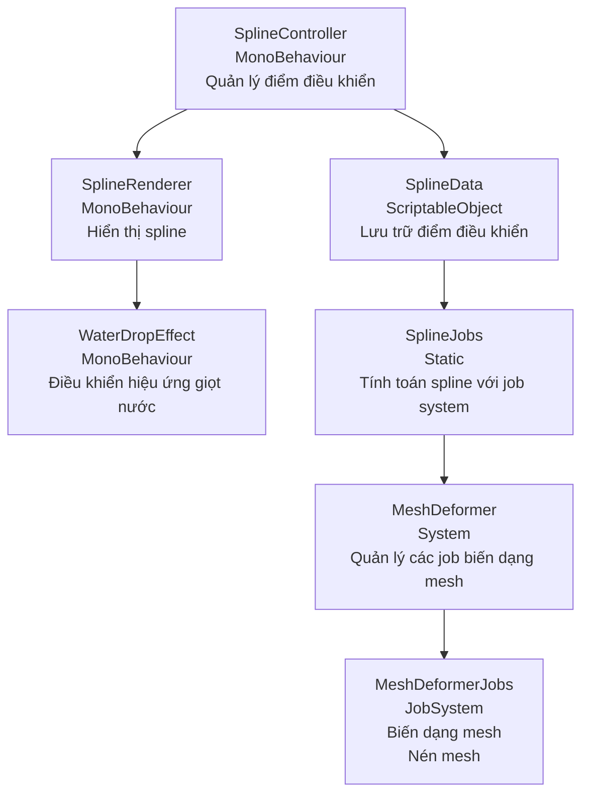

# SplineMesh - Hệ thống giọt nước di chuyển theo đường cong

SplineMesh là một hệ thống mạnh mẽ để tạo hiệu ứng di chuyển và biến dạng của đối tượng (như giọt nước) dọc theo đường cong Catmull-Rom trong Unity. Hệ thống được tối ưu hóa sử dụng Unity's Job System, Burst Compiler và unsafe code để đạt hiệu năng cao.


## Tính năng

- **Catmull-Rom Spline**: Tạo đường cong mượt mà với các điểm điều khiển dễ dàng chỉnh sửa.
- **Hiệu ứng biến dạng**: Đối tượng (giọt nước) xoay và biến dạng theo hình dạng của đường cong.
- **Hiệu ứng nén**: Hiệu ứng nén khi đối tượng đến gần cuối đường cong.
- **Tối ưu hóa cao**: Sử dụng Job System, Burst Compiler và unsafe pointers để đạt hiệu năng tốt nhất.
- **Công cụ Editor**: Công cụ tự động thiết lập scene demo với nhiều tùy chọn cấu hình.
- **API dễ sử dụng**: Giao diện đơn giản để điều khiển hiệu ứng từ code.

## Cài đặt

1. Clone hoặc tải repository này vào thư mục Assets của dự án Unity của bạn.
2. Đảm bảo rằng bạn đã cài đặt các package sau:
   - Unity Mathematics
   - Burst Compiler
   - Jobs
   - Collections

## Bắt đầu nhanh

### Sử dụng công cụ Demo Setup

1. Trong Unity, chọn menu **Tools > SplineMesh > Setup Demo Scene**.
2. Chọn loại demo (Simple, Complex, hoặc Custom).
3. Tùy chỉnh các thông số (nếu chọn Custom).
4. Nhấn nút "Create Demo" để tạo scene demo.

### Tự thiết lập

1. Tạo một GameObject mới và thêm component `SplineController` và `SplineRenderer`.
2. Thêm các điểm điều khiển bằng gọi `splineController.AddControlPoint(position)`.
3. Tạo một GameObject với MeshFilter và MeshRenderer để làm giọt nước.
4. Thêm component `WaterDropEffect` vào GameObject giọt nước.
5. Kéo thả SplineController vào trường tham chiếu trong WaterDropEffect.

## Kiến trúc hệ thống



## Các thành phần chính

### SplineData (ScriptableObject)
Lưu trữ các điểm điều khiển và thiết lập của spline.

### SplineController (MonoBehaviour)
Quản lý spline và cung cấp API để tương tác với các thành phần khác.

### SplineRenderer (MonoBehaviour)
Hiển thị spline trong scene view và game view.

### SplineJobs (Static Class)
Chứa các job để tính toán điểm, vector tiếp tuyến và pháp tuyến trên spline.

### MeshDeformer (Class)
Quản lý việc biến dạng mesh dọc theo spline.

### WaterDropEffect (MonoBehaviour)
Điều khiển hiệu ứng di chuyển và biến dạng của giọt nước.

## API

### SplineController

```csharp
// Lấy vị trí tại tham số t (0-1) trên spline
Vector3 GetPointAt(float t)

// Lấy vector tiếp tuyến tại t
Vector3 GetTangentAt(float t)

// Lấy vector pháp tuyến tại t
Vector3 GetNormalAt(float t)

// Thêm điểm điều khiển mới
void AddControlPoint(Vector3 point)

// Cập nhật điểm điều khiển
void UpdateControlPoint(int index, Vector3 point)

// Xóa điểm điều khiển
void RemoveControlPoint(int index)
```

### WaterDropEffect

```csharp
// Đặt vị trí của đối tượng tại tham số t trên spline
void PlaceAtParameter(float t)

// Bắt đầu animation
void StartAnimation()

// Dừng animation
void StopAnimation()

// Reset về vị trí đầu
void ResetAnimation()
```

## Tối ưu hóa & Unsafe Code

Hệ thống sử dụng các kỹ thuật tối ưu hóa để đạt hiệu năng cao:

1. **Con trỏ unsafe**: Truy cập trực tiếp vào dữ liệu NativeArray để bỏ qua các kiểm tra an toàn.
2. **MemCpy**: Copy dữ liệu hiệu quả giữa các mảng thay vì dùng vòng lặp.
3. **Burst Compiler**: Biên dịch các job thành mã máy tối ưu.
4. **Parallel Jobs**: Xử lý song song các tính toán nặng.

Lưu ý: Để sử dụng unsafe code, bạn cần bật tùy chọn "Allow 'unsafe' Code" trong Player Settings.

## Ví dụ code

```csharp
// Tạo đường cong từ code
SplineController splineController = GetComponent<SplineController>();
splineController.AddControlPoint(new Vector3(-5, 0, 0));
splineController.AddControlPoint(new Vector3(-3, 2, 0));
splineController.AddControlPoint(new Vector3(3, -2, 0));
splineController.AddControlPoint(new Vector3(5, 0, 0));

// Điều khiển hiệu ứng giọt nước
WaterDropEffect waterEffect = waterDrop.GetComponent<WaterDropEffect>();
waterEffect.SetSplineController(splineController);
waterEffect.StartAnimation();

// Xử lý sự kiện khi giọt nước di chuyển
void Update()
{
    float t = waterEffect.GetCurrentParameter();
    if (t > 0.9f)
    {
        // Xử lý khi giọt nước gần cuối spline
    }
}
```

## Lưu ý

- Nên sử dụng ít nhất 4 điểm điều khiển để tạo một đường cong Catmull-Rom có ý nghĩa.
- Giải phóng tài nguyên NativeArray khi không cần thiết nữa để tránh rò rỉ bộ nhớ.
- Để tối ưu hóa hơn nữa, hãy cân nhắc điều chỉnh batch size trong các job phù hợp với nền tảng mục tiêu.

## Giấy phép

Dự án này được phát hành theo giấy phép MIT. 