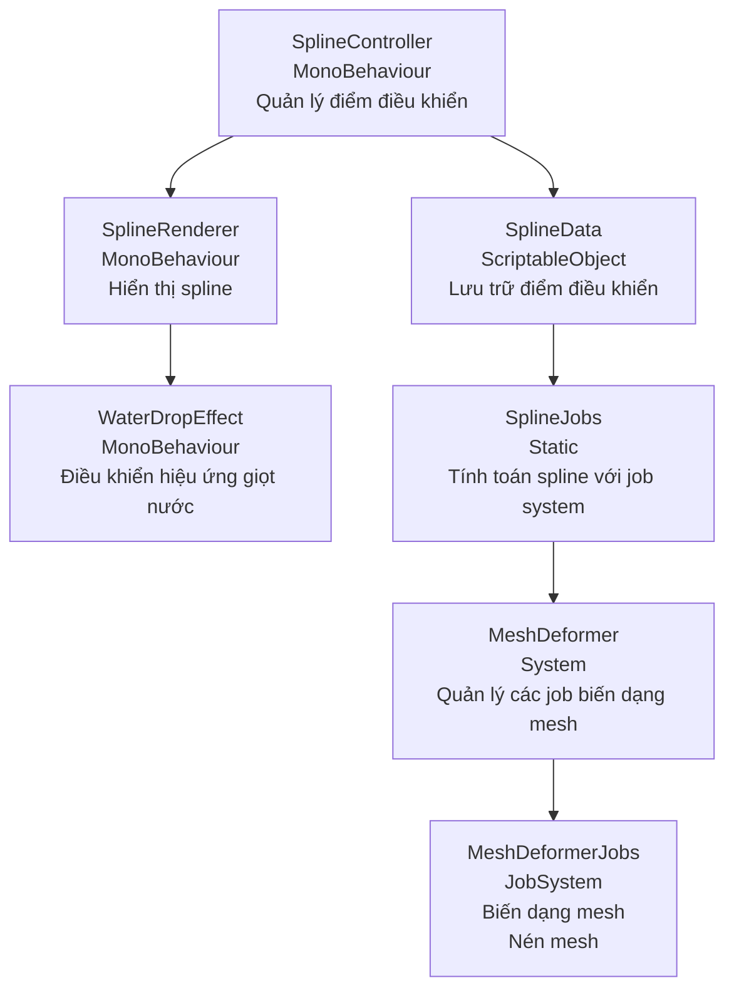
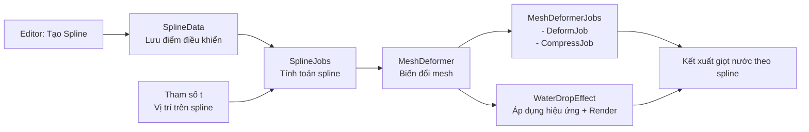

# Thiết kế kỹ thuật hệ thống Spline Animation cho giọt nước

## 1. Tổng quan

Hệ thống này sẽ cho phép một giọt nước di chuyển và biến dạng theo đường cong Catmull-Rom spline. Spline sẽ được tạo trong Editor, và trong runtime, giọt nước sẽ di chuyển, xoay và biến dạng theo hình dạng của spline.

### Yêu cầu chính:
- Spline Catmull-Rom 3D có thể chỉnh sửa trong Editor
- Giọt nước di chuyển theo tham số t (t=0 -> t=1)
- Giọt nước xoay và cong theo hướng của spline
- Hiệu ứng nén khi đi đến cuối spline
- Tối ưu hóa với JobSystem, Burst Compiler và unsafe code

## 2. Kiến trúc hệ thống



## 3. Các thành phần chính

### 3.1. SplineData (ScriptableObject)
- Lưu trữ danh sách các điểm điều khiển của spline
- Cung cấp các tham số như tension của Catmull-Rom
- Cho phép lưu/tải cấu hình spline

### 3.2. SplineController (MonoBehaviour)
- Giao diện Editor để thêm/xóa/di chuyển các điểm điều khiển
- Cung cấp các hàm để lấy thông tin từ spline (vị trí, hướng, độ cong)
- Kết nối với SplineData để lưu/tải cấu hình

### 3.3. SplineJobs
- Chứa các job để tính toán:
  - `CalculateSplinePointsJob`: Tính các điểm trên spline
  - `CalculateSplineTangentsJob`: Tính các vector tiếp tuyến
  - `CalculateSplineNormalsJob`: Tính các vector pháp tuyến

### 3.4. MeshDeformer
- Quản lý quá trình biến dạng mesh
- Xử lý dữ liệu đầu vào từ SplineJobs
- Điều phối các job biến dạng mesh

### 3.5. MeshDeformerJobs
- Chứa các job để biến dạng mesh:
  - `DeformMeshAlongSplineJob`: Biến đổi mesh theo spline
  - `CompressMeshJob`: Xử lý nén mesh theo tham số

### 3.6. WaterDropEffect
- Điều khiển hiệu ứng di chuyển và biến dạng của giọt nước
- Tham số hóa chuyển động (thời gian, tốc độ, đường cong)
- Xử lý hiệu ứng nén khi đến cuối spline

## 4. Luồng xử lý dữ liệu



## 5. Chi tiết triển khai

### 5.1. Catmull-Rom Spline với JobSystem và Unsafe Pointers

```csharp
[BurstCompile]
public struct CalculateSplinePointsJob : IJobParallelFor
{
    [ReadOnly] public NativeArray<float3> controlPoints;
    [ReadOnly] public float tension;
    [ReadOnly] public NativeArray<float> tValues;
    
    [NativeDisableParallelForRestriction]
    public NativeArray<float3> results;
    
    public unsafe void Execute(int index)
    {
        float t = tValues[index];
        // Xác định 4 điểm điều khiển cần thiết cho đoạn spline hiện tại
        int segment = math.min(math.max(0, (int)(t * (controlPoints.Length - 3))), controlPoints.Length - 4);
        float localT = (t * (controlPoints.Length - 3)) - segment;
        
        // Sử dụng con trỏ trực tiếp để truy cập dữ liệu nhanh hơn
        float3* controlPointsPtr = (float3*)controlPoints.GetUnsafeReadOnlyPtr();
        float3* resultsPtr = (float3*)results.GetUnsafePtr();
        
        // Tính toán điểm spline sử dụng công thức Catmull-Rom
        resultsPtr[index] = CalculateCatmullRomPoint(
            controlPointsPtr[segment],
            controlPointsPtr[segment + 1],
            controlPointsPtr[segment + 2],
            controlPointsPtr[segment + 3],
            localT,
            tension
        );
    }
    
    private float3 CalculateCatmullRomPoint(float3 p0, float3 p1, float3 p2, float3 p3, float t, float tension)
    {
        // Công thức Catmull-Rom
        float t2 = t * t;
        float t3 = t2 * t;
        
        float s = (1 - tension) / 2f;
        
        float3 result = p1 * 2f;
        result += (p2 - p0) * s * t;
        result += (p0 * 2f - p1 * 5f + p2 * 4f - p3) * s * t2;
        result += (p1 * 3f - p0 - p2 * 3f + p3) * s * t3;
        result *= 0.5f;
        
        return result;
    }
}
```

### 5.2. Tính toán các vector tiếp tuyến và pháp tuyến với Unsafe Pointers

```csharp
[BurstCompile]
public struct CalculateSplineTangentsJob : IJobParallelFor
{
    [ReadOnly] public NativeArray<float3> splinePoints;
    [NativeDisableParallelForRestriction]
    public NativeArray<float3> tangents;
    
    public unsafe void Execute(int index)
    {
        // Sử dụng con trỏ để truy cập nhanh hơn
        float3* pointsPtr = (float3*)splinePoints.GetUnsafeReadOnlyPtr();
        float3* tangentsPtr = (float3*)tangents.GetUnsafePtr();
        
        if (index == 0)
        {
            // Điểm đầu tiên - sử dụng sai phân tiến
            tangentsPtr[index] = math.normalize(pointsPtr[index + 1] - pointsPtr[index]);
        }
        else if (index == splinePoints.Length - 1)
        {
            // Điểm cuối cùng - sử dụng sai phân lùi
            tangentsPtr[index] = math.normalize(pointsPtr[index] - pointsPtr[index - 1]);
        }
        else
        {
            // Các điểm giữa - sử dụng sai phân trung tâm
            tangentsPtr[index] = math.normalize(pointsPtr[index + 1] - pointsPtr[index - 1]);
        }
    }
}

[BurstCompile]
public struct CalculateSplineNormalsJob : IJobParallelFor
{
    [ReadOnly] public NativeArray<float3> tangents;
    [NativeDisableParallelForRestriction]
    public NativeArray<float3> normals;
    
    public unsafe void Execute(int index)
    {
        float3* tangentsPtr = (float3*)tangents.GetUnsafeReadOnlyPtr();
        float3* normalsPtr = (float3*)normals.GetUnsafePtr();
        
        // Tính vector up (mặc định)
        float3 up = new float3(0, 1, 0);
        
        // Xử lý trường hợp tangent gần với up quá mức
        if (math.abs(math.dot(tangentsPtr[index], up)) > 0.999f)
        {
            up = new float3(1, 0, 0);
        }
        
        // Tính normal (vuông góc với tangent)
        normalsPtr[index] = math.normalize(math.cross(math.cross(tangentsPtr[index], up), tangentsPtr[index]));
    }
}
```

### 5.3. Biến dạng mesh giọt nước với Unsafe Pointers

```csharp
[BurstCompile]
public struct DeformMeshAlongSplineJob : IJobParallelFor
{
    [ReadOnly] public NativeArray<float3> originalVertices;
    [ReadOnly] public NativeArray<float3> splinePoints;
    [ReadOnly] public NativeArray<float3> splineTangents;
    [ReadOnly] public NativeArray<float3> splineNormals;
    [ReadOnly] public float dropParameter; // t từ 0->1
    [ReadOnly] public float compressionFactor; // Hệ số nén (1.0 = không nén)
    
    [NativeDisableParallelForRestriction]
    public NativeArray<float3> deformedVertices;
    
    public unsafe void Execute(int index)
    {
        // Sử dụng con trỏ để truy cập nhanh hơn
        float3* origPtr = (float3*)originalVertices.GetUnsafeReadOnlyPtr();
        float3* splinePtr = (float3*)splinePoints.GetUnsafeReadOnlyPtr();
        float3* tangentPtr = (float3*)splineTangents.GetUnsafeReadOnlyPtr();
        float3* normalPtr = (float3*)splineNormals.GetUnsafeReadOnlyPtr();
        float3* defPtr = (float3*)deformedVertices.GetUnsafePtr();
        
        // Lấy vị trí ban đầu của đỉnh
        float3 vertex = origPtr[index];
        
        // Tìm điểm gần nhất trên spline dựa vào tham số dropParameter
        int splineIndex = math.min((int)(dropParameter * (splinePoints.Length - 1)), splinePoints.Length - 1);
        float3 splinePoint = splinePtr[splineIndex];
        float3 tangent = tangentPtr[splineIndex];
        float3 normal = normalPtr[splineIndex];
        float3 binormal = math.cross(normal, tangent);
        
        // Tạo ma trận biến đổi từ không gian local sang không gian spline
        float3x3 transformMatrix = new float3x3(
            binormal,
            normal,
            tangent
        );
        
        // Áp dụng hiệu ứng nén dọc theo trục di chuyển
        float compressionMultiplier = 1.0f;
        if (dropParameter > 0.8f)
        {
            // Nén dần khi tiến gần về cuối spline
            compressionMultiplier = math.lerp(1.0f, compressionFactor, (dropParameter - 0.8f) * 5f);
            vertex.z *= compressionMultiplier;
        }
        
        // Biến đổi đỉnh vào không gian spline
        float3 transformedVertex = math.mul(transformMatrix, vertex);
        
        // Đặt đỉnh vào vị trí mới dọc theo spline
        defPtr[index] = splinePoint + transformedVertex;
    }
}

[BurstCompile]
public struct CompressMeshJob : IJobParallelFor
{
    [ReadOnly] public NativeArray<float3> inputVertices;
    [ReadOnly] public float compressionAmount; // 0.0 = không nén, 1.0 = nén tối đa
    [ReadOnly] public float3 compressionDirection; // Hướng nén
    
    [NativeDisableParallelForRestriction]
    public NativeArray<float3> outputVertices;
    
    public unsafe void Execute(int index)
    {
        float3* inPtr = (float3*)inputVertices.GetUnsafeReadOnlyPtr();
        float3* outPtr = (float3*)outputVertices.GetUnsafePtr();
        
        float3 vertex = inPtr[index];
        
        // Tính toán hệ số nén dựa vào vị trí trên mesh
        float distanceInCompressionDirection = math.dot(vertex, compressionDirection);
        float compressionFactor = 1.0f - (compressionAmount * math.saturate(distanceInCompressionDirection));
        
        // Áp dụng biến dạng
        float3 offset = compressionDirection * distanceInCompressionDirection * (1.0f - compressionFactor);
        outPtr[index] = vertex - offset;
    }
}
```

### 5.4. WaterDropEffect (Với hỗ trợ unsafe)

```csharp
public class WaterDropEffect : MonoBehaviour
{
    public SplineController splineController;
    public Transform waterDropModel;
    public float duration = 3.0f; // Thời gian di chuyển từ đầu đến cuối
    public float compressionFactor = 0.5f; // Hệ số nén khi đến cuối (0.5 = nén 50%)
    
    private MeshFilter meshFilter;
    private MeshDeformer meshDeformer;
    private float dropParameter = 0f; // t từ 0->1
    
    private void Start()
    {
        meshFilter = waterDropModel.GetComponent<MeshFilter>();
        meshDeformer = new MeshDeformer(meshFilter.mesh);
        
        // Khởi tạo dữ liệu
        meshDeformer.Initialize();
    }
    
    private void Update()
    {
        // Cập nhật tham số t dựa theo thời gian
        dropParameter += Time.deltaTime / duration;
        if (dropParameter > 1.0f)
            dropParameter = 0f; // Reset về đầu spline
            
        // Cập nhật lại mesh
        UpdateMesh();
    }
    
    private void UpdateMesh()
    {
        // Lấy thông tin spline hiện tại
        var splineData = splineController.GetSplineData(100); // 100 điểm mẫu
        
        // Cập nhật mesh thông qua MeshDeformer
        meshDeformer.DeformAlongSpline(
            splineData.points,
            splineData.tangents,
            splineData.normals,
            dropParameter,
            compressionFactor
        );
        
        // Áp dụng các thay đổi vào mesh
        meshDeformer.ApplyDeformation(meshFilter.mesh);
    }
    
    private void OnDestroy()
    {
        // Giải phóng tài nguyên
        meshDeformer.Dispose();
    }
}
```

### 5.5. MeshDeformer với Unsafe Memory Manipulation

```csharp
public class MeshDeformer : System.IDisposable
{
    private NativeArray<float3> originalVertices;
    private NativeArray<float3> deformedVertices;
    private int vertexCount;
    
    public MeshDeformer(Mesh mesh)
    {
        vertexCount = mesh.vertexCount;
    }
    
    public unsafe void Initialize()
    {
        // Khởi tạo NativeArrays
        originalVertices = new NativeArray<float3>(vertexCount, Allocator.Persistent);
        deformedVertices = new NativeArray<float3>(vertexCount, Allocator.Persistent);
        
        // Copy dữ liệu đỉnh ban đầu từ mesh
        Vector3[] meshVertices = mesh.vertices;
        
        // Sử dụng unsafe để copy nhanh
        fixed (Vector3* meshVerticesPtr = meshVertices)
        {
            UnsafeUtility.MemCpy(
                originalVertices.GetUnsafePtr(),
                meshVerticesPtr,
                vertexCount * UnsafeUtility.SizeOf<Vector3>()
            );
        }
    }
    
    public void DeformAlongSpline(
        NativeArray<float3> splinePoints, 
        NativeArray<float3> splineTangents, 
        NativeArray<float3> splineNormals,
        float dropParameter,
        float compressionFactor)
    {
        // Tạo và lên lịch job biến dạng
        var deformJob = new DeformMeshAlongSplineJob
        {
            originalVertices = originalVertices,
            splinePoints = splinePoints,
            splineTangents = splineTangents,
            splineNormals = splineNormals,
            dropParameter = dropParameter,
            compressionFactor = compressionFactor,
            deformedVertices = deformedVertices
        };
        
        // Lên lịch và hoàn thành job
        JobHandle jobHandle = deformJob.Schedule(vertexCount, 64);
        jobHandle.Complete();
    }
    
    public unsafe void ApplyDeformation(Mesh mesh)
    {
        // Tối ưu hóa bằng cách sử dụng unsafe để truy cập và sao chép dữ liệu trực tiếp
        Vector3[] vertices = new Vector3[vertexCount];
        
        fixed (Vector3* verticesPtr = vertices)
        {
            UnsafeUtility.MemCpy(
                verticesPtr,
                deformedVertices.GetUnsafePtr(),
                vertexCount * UnsafeUtility.SizeOf<Vector3>()
            );
        }
        
        // Áp dụng các thay đổi vào mesh
        mesh.vertices = vertices;
        mesh.RecalculateNormals();
        mesh.RecalculateBounds();
    }
    
    // Phiên bản nâng cao - truy cập mesh vertices trực tiếp để tối ưu tốc độ
    public unsafe void FastApplyDeformation(Mesh mesh)
    {
        // Phương thức này truy cập trực tiếp vào Mesh API nội bộ
        // Cảnh báo: Cần thận trọng khi sử dụng vì có thể thay đổi trong các phiên bản Unity khác nhau
        
        var meshDataArray = Mesh.AcquireReadOnlyMeshData(mesh);
        var meshData = meshDataArray[0];
        
        // Lấy vertices buffer
        var verticesBuffer = new NativeArray<Vector3>(vertexCount, Allocator.Temp);
        
        // Copy dữ liệu từ deformedVertices sang verticesBuffer
        UnsafeUtility.MemCpy(
            verticesBuffer.GetUnsafePtr(),
            deformedVertices.GetUnsafeReadOnlyPtr(),
            vertexCount * UnsafeUtility.SizeOf<Vector3>()
        );
        
        // Cập nhật mesh
        mesh.SetVertices(verticesBuffer);
        mesh.RecalculateNormals();
        mesh.RecalculateBounds();
        
        // Giải phóng tài nguyên tạm thời
        verticesBuffer.Dispose();
        meshDataArray.Dispose();
    }
    
    public void Dispose()
    {
        if (originalVertices.IsCreated) originalVertices.Dispose();
        if (deformedVertices.IsCreated) deformedVertices.Dispose();
    }
}
```

## 6. Tối ưu với Unsafe Pointers

### 6.1. Bỏ qua kiểm tra an toàn (Safety Checks)

Việc sử dụng con trỏ (unsafe pointers) để truy cập trực tiếp vào NativeArray cho phép bỏ qua các kiểm tra an toàn, dẫn đến hiệu suất cao hơn:

```csharp
[BurstCompile]
public unsafe struct OptimizedNativeArrayAccessJob : IJobParallelFor
{
    [NativeDisableParallelForRestriction] 
    public NativeArray<float> data;

    public void Execute(int index)
    {
        // Cách truyền thống (có kiểm tra an toàn)
        // data[index] = data[index] * 2.0f;
        
        // Cách tối ưu với unsafe pointers (không có kiểm tra an toàn)
        float* dataPtr = (float*)data.GetUnsafePtr();
        dataPtr[index] = dataPtr[index] * 2.0f;
    }
}
```

### 6.2. Tối ưu hóa sao chép dữ liệu

Sử dụng `UnsafeUtility.MemCpy` để sao chép dữ liệu hiệu quả hơn so với vòng lặp:

```csharp
public unsafe void CopyVertexData(NativeArray<Vector3> source, NativeArray<Vector3> destination)
{
    // Cách thông thường (chậm)
    /*
    for (int i = 0; i < source.Length; i++)
    {
        destination[i] = source[i];
    }
    */
    
    // Cách tối ưu với MemCpy (nhanh hơn nhiều)
    UnsafeUtility.MemCpy(
        destination.GetUnsafePtr(),
        source.GetUnsafeReadOnlyPtr(),
        source.Length * UnsafeUtility.SizeOf<Vector3>()
    );
}
```

### 6.3. Truy cập mảng trong vòng lặp lồng nhau

Sử dụng con trỏ để tính toán offset một lần duy nhất thay vì mỗi lần truy cập:

```csharp
[BurstCompile]
public unsafe struct OptimizedNestedLoopJob : IJob
{
    [ReadOnly] public NativeArray<float> inputArray;
    [WriteOnly] public NativeArray<float> outputArray;
    public int width;
    public int height;
    
    public void Execute()
    {
        float* input = (float*)inputArray.GetUnsafeReadOnlyPtr();
        float* output = (float*)outputArray.GetUnsafePtr();
        
        for (int y = 0; y < height; y++)
        {
            // Tính offset một lần cho mỗi hàng
            int rowOffset = y * width;
            
            for (int x = 0; x < width; x++)
            {
                // Truy cập trực tiếp với con trỏ = nhanh hơn
                int index = rowOffset + x;
                output[index] = input[index] * 2.0f;
            }
        }
    }
}
```

## 7. Trình tự thực hiện

1. **Giai đoạn Editor**:
   - Tạo SplineController cho phép đặt và chỉnh sửa các điểm điều khiển
   - Xem trước đường spline trong Scene view
   - Lưu cấu hình spline

2. **Giai đoạn Initialization**:
   - Khởi tạo NativeArrays để sử dụng với JobSystem
   - Đọc thông tin mesh ban đầu của giọt nước
   - Tiền tính toán các giá trị cần thiết

3. **Mỗi Frame**:
   - Cập nhật tham số t dựa trên thời gian
   - Tính toán điểm, hướng, và pháp tuyến trên spline bằng JobSystem
   - Biến dạng mesh giọt nước bằng JobSystem
   - Áp dụng hiệu ứng nén nếu cần
   - Cập nhật mesh hiển thị

4. **Tối ưu hóa**:
   - Sử dụng Burst Compiler cho tất cả các job
   - Sử dụng unsafe code để truy cập trực tiếp vào dữ liệu mesh
   - Sử dụng NativeContainer để tránh allocation GC
   - Sử dụng con trỏ để bỏ qua kiểm tra an toàn trong vòng lặp nóng
   - Sử dụng UnsafeUtility.MemCpy để sao chép dữ liệu lớn

## 8. Lưu ý khi sử dụng Unsafe Pointers

1. **Chạy mã chỉ trong môi trường an toàn**:
   - Sử dụng `[NativeDisableParallelForRestriction]` khi cần thiết
   - Đảm bảo không có đọc/ghi đồng thời trên cùng một địa chỉ bộ nhớ

2. **Kiểm tra đầy đủ**:
   - Khi sử dụng unsafe pointer, đảm bảo kiểm tra bounds một cách thủ công
   - Thêm kiểm tra điều kiện để tránh truy cập ngoài bounds: `if (index < length)`

3. **Giải phóng tài nguyên**:
   - Luôn đảm bảo dispose NativeArray sau khi sử dụng
   - Sử dụng khối try-finally để đảm bảo tài nguyên được giải phóng

4. **Tương thích đa nền tảng**:
   - Đảm bảo code unsafe hoạt động trên nhiều nền tảng khác nhau
   - Thử nghiệm trên cả editor và build

## 9. Kết luận

Kiến trúc này cho phép tạo ra hiệu ứng animation giọt nước di chuyển theo spline với hiệu năng cao nhờ JobSystem, Burst Compiler và unsafe pointers. Việc tách các thành phần thành những module riêng biệt giúp code dễ bảo trì và mở rộng, đồng thời tối ưu hóa việc tính toán song song cho các đỉnh mesh.

Với việc sử dụng con trỏ unsafe để truy cập trực tiếp vào dữ liệu NativeArray, hệ thống sẽ chạy nhanh hơn đáng kể so với việc sử dụng các phương thức truy cập mảng thông thường có kiểm tra an toàn. 