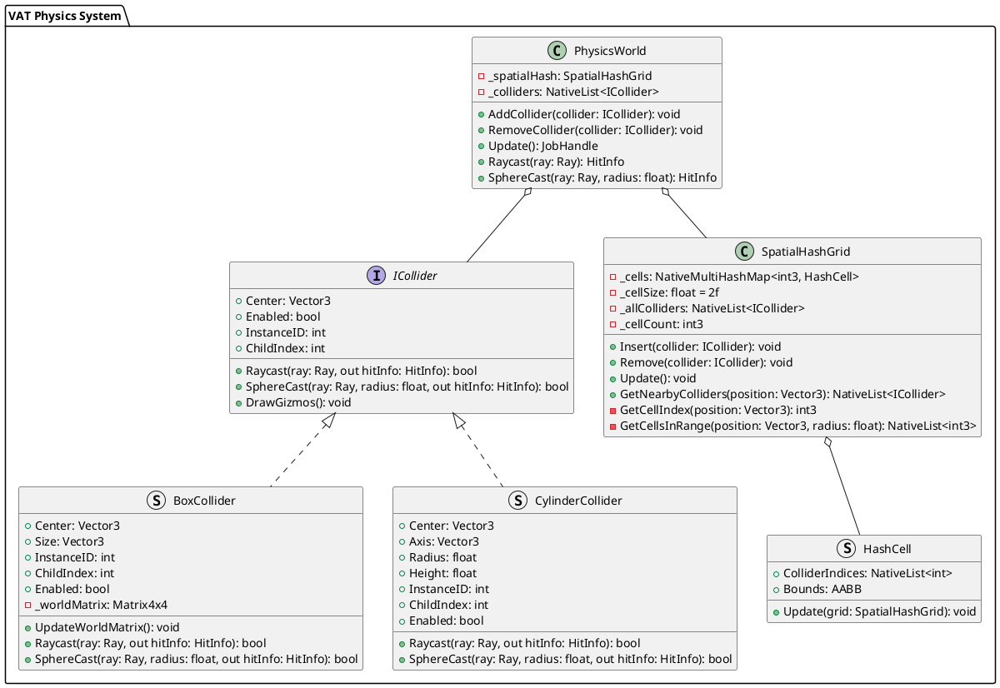

# Software Design Specification: BoxCollider và Spatial Hash cho VAT Physics

## 1. Tổng quan

### 1.1. Mục tiêu
- Triển khai BoxCollider như một lựa chọn thay thế cho CylinderCollider
- Triển khai Spatial Hash để tối ưu hiệu năng kiểm tra va chạm
- Duy trì hiệu năng > 30 FPS trên điện thoại Mi5 với 1000 bot

### 1.2. Phạm vi
- Thêm BoxCollider vào hệ thống physics hiện tại
- Triển khai Spatial Hash cho cả BoxCollider và CylinderCollider
- Cập nhật các phương thức raycast và collision detection
- Thêm công cụ chuyển đổi từ Cylinder sang Box

## 2. Thiết kế chi tiết

### 2.1. UML Diagram


### 2.2. Cấu trúc dữ liệu

1. **BoxCollider**
```csharp
[Serializable]
public struct BoxCollider : ICollider
{
    public Vector3 Center;        // Tâm box
    public Vector3 Size;          // Kích thước box
    public int InstanceID;        // ID của instance
    public int ChildIndex;        // Index của collider con
    public bool Enabled;          // Trạng thái active
}
```

2. **SpatialHash**
```csharp
public struct HashCell
{
    public NativeList<int> ColliderIndices;  // Danh sách index của collider
    public AABB Bounds;                      // Bounds của cell
}

public class SpatialHashGrid
{
    private NativeMultiHashMap<int3, HashCell> _cells;
    private const float CELL_SIZE = 2f;  // Kích thước cell bằng kích thước bot
    private NativeList<ICollider> _allColliders;
    private int3 _cellCount;  // 5x5 cells cho map 10x10
}
```

### 2.3. Thuật toán chính

1. **Box-Ray Intersection**
```csharp
public bool BoxRaycast(Ray ray, BoxCollider box, out HitInfo hitInfo)
{
    // 1. Transform ray to box local space
    // 2. AABB-Ray intersection test
    // 3. Transform hit point back to world space
}
```

2. **Spatial Hash Update**
```csharp
public void UpdateSpatialHash()
{
    // 1. Clear all cells
    // 2. Calculate cell indices for each collider
    // 3. Insert colliders into cells
    // 4. Update cell bounds
}

// Cache system
private NativeArray<int3> _lastCellIndices;  // Cache cell indices từ frame trước
private NativeArray<bool> _needsUpdate;      // Đánh dấu collider cần update

public void UpdateWithCache()
{
    // 1. So sánh vị trí hiện tại với cell index đã cache
    // 2. Chỉ update các collider đã di chuyển sang cell khác
    // 3. Giữ nguyên các collider không thay đổi cell
    // 4. Update bounds của các cell bị ảnh hưởng
}
```

3. **Collision Query**
```csharp
public NativeList<int> GetPotentialColliders(Vector3 position, float radius)
{
    // 1. Calculate affected cells (dựa trên CELL_SIZE = 2f)
    // 2. Gather unique collider indices
    // 3. Return filtered list
}
```

### 2.4. Tích hợp BoxCollider với hệ thống hiện tại

#### 2.4.1. Cập nhật cấu trúc dữ liệu

1. **Thêm BoxCollider struct**
```csharp
[Serializable]
public struct BoxCollider
{
    public Vector3 center;        // Tâm box
    public Vector3 size;          // Kích thước box
    public int InstanceID;        // ID của instance
    public int ChildIndex;        // Index của collider con
}
```

2. **Cập nhật ColliderCacheData**
```csharp
[Serializable]
public struct FrameInfo
{
    public ColliderData[] colliderInfos;
}

[Serializable]
public struct ColliderData
{
    public ColliderType type;     // Loại collider (Box/Cylinder)
    public Vector3 center;        // Tâm collider
    public Vector3 size;          // Cho BoxCollider
    public Vector3 axis;          // Cho CylinderCollider
    public float radius;          // Cho CylinderCollider
    public float height;          // Cho CylinderCollider
}

public enum ColliderType
{
    Box,
    Cylinder
}
```

#### 2.4.2. Cập nhật Physics System

1. **Raycast Job với BoxCollider**
```csharp
[BurstCompile]
private unsafe struct VAT_RaycastJob : IJobParallelForTransform
{
    public void Execute(int index, TransformAccess transform)
    {
        var colliderInfo = ColliderInfoAddress[index];
        if (!colliderInfo.enabled) return;

        var collider = colliders[i];
        var hitInfo = hitInfos + i;

        if (collider.type == ColliderType.Box)
        {
            // Box raycast logic
            float4 center = math.mul(transform.localToWorldMatrix, 
                                   new float4(collider.center, 1));
            Vector3 scale = transform.localScale;
            
            var box = new BoxCollider
            {
                center = center.xyz,
                size = collider.size * scale
            };

            if (BoxRaycast(Ray, box, out var hitPoint))
            {
                hitInfo->hit = true;
                hitInfo->point = hitPoint;
                hitInfo->distance = math.distance(Ray.origin, hitPoint);
            }
        }
        else
        {
            // Existing cylinder raycast logic
            float4 center = math.mul(transform.localToWorldMatrix, 
                                   new float4(collider.center, 1));
            float4 axis = math.mul(transform.localToWorldMatrix, 
                                 new float4(collider.axis, 1));
            Vector3 scale = transform.localScale;

            var cylinder = new CylinderExtend
            {
                center = center.xyz,
                axis = math.normalize(axis.xyz),
                radius = new(collider.radius * scale.x, 
                           collider.radius * scale.z),
                height = collider.height * scale.y * 0.5f
            };

            if (IntersectRayCylinder(Ray, cylinder, out var hitPoint))
            {
                hitInfo->hit = true;
                hitInfo->point = hitPoint;
                hitInfo->distance = math.distance(Ray.origin, hitPoint);
            }
        }
    }
}
```

2. **Bake Tool cho BoxCollider**
```csharp
public void BakeCollider()
{
    case BoxCollider:
    {
        var boxCollider = (BoxCollider)colliders[i];
        colliderData = new ColliderData
        {
            type = ColliderType.Box,
            center = boxCollider.center,
            size = boxCollider.size
        };
        break;
    }
}
```

#### 2.4.3. Xử lý Box-Ray Intersection

1. **Transform Ray**
```csharp
private Ray TransformRayToBoxSpace(Ray ray, BoxCollider box)
{
    // 1. Translate ray origin to box space
    Vector3 localOrigin = ray.origin - box.center;
    
    // 2. Scale ray for box size
    Vector3 invScale = new Vector3(1f/box.size.x, 1f/box.size.y, 1f/box.size.z);
    Vector3 scaledOrigin = Vector3.Scale(localOrigin, invScale);
    Vector3 scaledDirection = Vector3.Scale(ray.direction, invScale).normalized;
    
    return new Ray(scaledOrigin, scaledDirection);
}
```

2. **AABB Test**
```csharp
private bool IntersectRayAABB(Ray localRay, out Vector3 hitPoint)
{
    hitPoint = Vector3.zero;
    Vector3 invDir = new Vector3(1f/localRay.direction.x,
                                1f/localRay.direction.y,
                                1f/localRay.direction.z);
    
    // AABB bounds from -0.5 to 0.5 in local space
    Vector3 t0 = Vector3.Scale((-Vector3.one * 0.5f - localRay.origin), invDir);
    Vector3 t1 = Vector3.Scale((Vector3.one * 0.5f - localRay.origin), invDir);
    
    Vector3 tmin = Vector3.Min(t0, t1);
    Vector3 tmax = Vector3.Max(t0, t1);
    
    float enterTime = Mathf.Max(tmin.x, Mathf.Max(tmin.y, tmin.z));
    float exitTime = Mathf.Min(tmax.x, Mathf.Min(tmax.y, tmax.z));
    
    if (enterTime <= exitTime && exitTime >= 0)
    {
        hitPoint = localRay.origin + localRay.direction * enterTime;
        return true;
    }
    
    return false;
}
```

[Rest of the document remains unchanged from "## 3. Test Cases" onwards] 