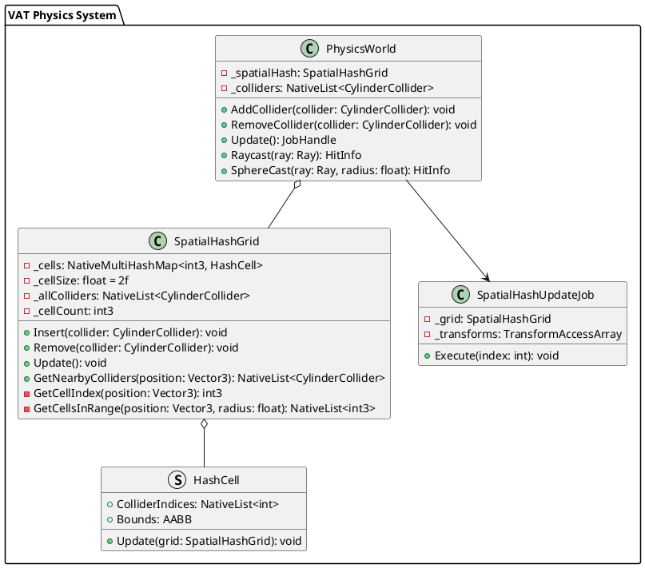

# Software Design Specification: Spatial Hash cho VAT Physics

## 1. Tổng quan

### 1.1. Mục tiêu
- Triển khai Spatial Hash để tối ưu hiệu năng kiểm tra va chạm
- Duy trì hiệu năng > 30 FPS trên điện thoại Mi5 với 1000 bot
- Giảm số lượng collision checks mỗi frame

### 1.2. Phạm vi
- Triển khai Spatial Hash cho CylinderCollider hiện tại
- Tối ưu collision detection với spatial partitioning
- Thêm cache system để giảm thiểu việc tính toán lại

## 2. Thiết kế chi tiết

### 2.1. UML Diagram


### 2.2. Cấu trúc dữ liệu

1. **SpatialHashGrid**
```csharp
public class SpatialHashGrid
{
    private NativeMultiHashMap<int3, HashCell> _cells;
    private const float CELL_SIZE = 2f;  // Kích thước cell bằng kích thước bot
    private NativeList<CylinderCollider> _allColliders;
    private int3 _cellCount;  // 5x5 cells cho map 10x10
    
    // Cache system
    private NativeArray<int3> _lastCellIndices;  // Cache cell indices từ frame trước
    private NativeArray<bool> _needsUpdate;      // Đánh dấu collider cần update
}
```

2. **HashCell**
```csharp
public struct HashCell
{
    public NativeList<int> ColliderIndices;  // Danh sách index của collider
    public AABB Bounds;                      // Bounds của cell
}
```

### 2.3. Thuật toán chính

1. **Spatial Hash Update**
```csharp
[BurstCompile]
public struct SpatialHashUpdateJob : IJobParallelFor
{
    [ReadOnly] public NativeArray<CylinderCollider> Colliders;
    [ReadOnly] public NativeArray<float4x4> WorldMatrices;
    public NativeMultiHashMap<int3, HashCell>.ParallelWriter Cells;
    public float CellSize;

    public void Execute(int index)
    {
        var collider = Colliders[index];
        var worldPos = WorldMatrices[index].c3.xyz;
        
        // Calculate cell index
        int3 cellIndex = new int3(
            (int)(worldPos.x / CellSize),
            (int)(worldPos.y / CellSize),
            (int)(worldPos.z / CellSize)
        );
        
        // Add to appropriate cell
        var cell = new HashCell();
        cell.ColliderIndices.Add(index);
        cell.Bounds = CalculateBounds(collider, WorldMatrices[index]);
        
        Cells.Add(cellIndex, cell);
    }
}
```

2. **Collision Query với Spatial Hash**
```csharp
public NativeList<int> GetPotentialColliders(Vector3 position, float radius)
{
    var result = new NativeList<int>(Allocator.Temp);
    
    // Calculate affected cells
    int3 minCell = GetCellIndex(position - Vector3.one * radius);
    int3 maxCell = GetCellIndex(position + Vector3.one * radius);
    
    // Gather colliders from affected cells
    for (int x = minCell.x; x <= maxCell.x; x++)
    for (int y = minCell.y; y <= maxCell.y; y++)
    for (int z = minCell.z; z <= maxCell.z; z++)
    {
        var cellIndex = new int3(x, y, z);
        if (_cells.TryGetFirstValue(cellIndex, out var cell, out var iterator))
        {
            do
            {
                result.AddRange(cell.ColliderIndices);
            } 
            while (_cells.TryGetNextValue(out cell, ref iterator));
        }
    }
    
    return result;
}
```

3. **Cache System**
```csharp
public void UpdateWithCache()
{
    for (int i = 0; i < _allColliders.Length; i++)
    {
        var collider = _allColliders[i];
        var currentCell = GetCellIndex(collider.center);
        
        // Chỉ update nếu collider đã di chuyển sang cell khác
        if (currentCell.Equals(_lastCellIndices[i])) continue;
        
        // Remove from old cell
        RemoveFromCell(_lastCellIndices[i], i);
        
        // Add to new cell
        AddToCell(currentCell, i);
        
        // Update cache
        _lastCellIndices[i] = currentCell;
    }
}
```

## 3. Test Cases

### 3.1. SpatialHash Tests

1. **Insert_Collider**
```csharp
[Test]
public void Insert_Collider_AddsToCorrectCell()
{
    var grid = new SpatialHashGrid(cellSize: 2f);
    var collider = new CylinderCollider
    {
        center = new Vector3(1f, 0f, 1f),
        radius = 0.5f
    };
    
    grid.Insert(collider);
    var nearbyColliders = grid.GetNearbyColliders(Vector3.one);
    
    Assert.AreEqual(1, nearbyColliders.Length);
}
```

2. **Query_Range**
```csharp
[Test]
public void Query_Range_ReturnsCorrectColliders()
{
    var grid = new SpatialHashGrid(cellSize: 2f);
    for(int i = 0; i < 10; i++)
    {
        grid.Insert(new CylinderCollider
        {
            center = new Vector3(i * 2f, 0f, 0f),
            radius = 0.5f
        });
    }
    
    var nearby = grid.GetNearbyColliders(Vector3.zero, radius: 3f);
    Assert.AreEqual(2, nearby.Length);  // Should find 2 colliders within radius
}
```

3. **Cache_System**
```csharp
[Test]
public void Cache_System_OnlyUpdatesMovedColliders()
{
    var grid = new SpatialHashGrid(cellSize: 2f);
    var collider = new CylinderCollider
    {
        center = Vector3.zero,
        radius = 0.5f
    };
    
    grid.Insert(collider);
    int updateCount = 0;
    
    // Move slightly within same cell
    collider.center += Vector3.one * 0.1f;
    grid.UpdateWithCache();
    Assert.AreEqual(0, updateCount);  // No update needed
    
    // Move to different cell
    collider.center += Vector3.one * 2f;
    grid.UpdateWithCache();
    Assert.AreEqual(1, updateCount);  // Update needed
}
```

## 4. Performance Metrics

### 4.1. Memory Usage
- SpatialHash: ~500KB cho 1000 bot (5x5 cells)
- Cache system: ~20KB cho position cache
- Temporary allocations: < 100KB per frame

### 4.2. CPU Time
- SpatialHash update: < 0.2ms per frame
- Collision query: < 0.05ms per query
- Cache system overhead: < 0.1ms per frame

### 4.3. Batch Sizes
- Update job batch size: 64 colliders per job
- Maximum colliders per cell: 64
- Cell size: 2 units (matched to bot size)

## 5. Kế hoạch triển khai

### 5.1. Phase 1: Core Implementation (1 ngày)
1. Triển khai SpatialHashGrid
2. Tích hợp với CylinderCollider
3. Unit tests cơ bản

### 5.2. Phase 2: Cache System (1 ngày)
1. Triển khai cache system
2. Tối ưu update logic
3. Performance tests

### 5.3. Phase 3: Integration & Testing (1 ngày)
1. Tích hợp với VAT_Physics
2. Profiling và optimization
3. Documentation và examples 